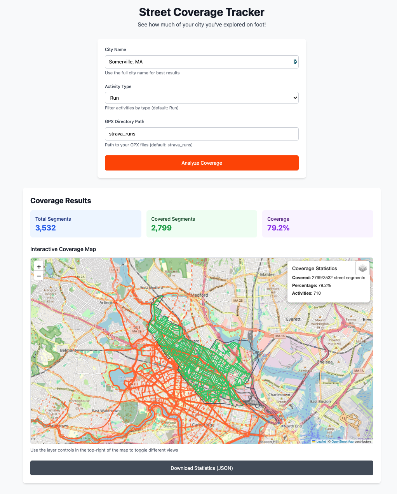

# Map Coverage Tracker

A Python application to track street coverage from Strava activities using GPS data. See how much of your city you've explored on foot!



## What You Need

### 1. GPX Files
You need GPX files from your activities. You can get these by:
- **Strava Export**: Download your data from Strava's export feature
- **Strava API**: Use the included `strava_client.py` to download activities
- **Other Apps**: Any fitness app that exports GPX files

### 2. Strava API (Optional)
If you want to download activities directly, you'll need:
- Strava API credentials (see setup below)
- Or manually export your GPX files from Strava

## Setup

This project uses `uv` for dependency management:

1. **Install uv** (if not already installed):
   ```bash
   curl -LsSf https://astral.sh/uv/install.sh | sh
   ```

2. **Install dependencies**:
   ```bash
   uv sync
   ```

3. **Get your GPX files** (choose one):
   - **Option A**: Use the Strava client (requires API setup below)
   - **Option B**: Manually export GPX files from Strava to a folder

### Strava API Setup (Optional)

If using the Strava client to download activities:

1. Create a Strava app at https://www.strava.com/settings/api
2. Get your Client ID and Client Secret
3. Create `strava_credentials.json`:
   ```json
   {
       "strava_client_id": "YOUR_CLIENT_ID",
       "strava_client_secret": "YOUR_CLIENT_SECRET"
   }
   ```

## Usage

### Web Application (Recommended)

1. **Start the server**:
   ```bash
   uv run python webapp.py
   ```

2. **Open your browser** to `http://localhost:8000`

3. **Enter your city name** (e.g., "Somerville, Massachusetts, USA")

4. **Select activity type** (Run is the default)

5. **Specify your GPX directory** (where your .gpx files are stored)

6. **Click "Analyze Coverage"** to see your results!

### Command Line

If you prefer the command line:

1. **Download activities** (if using Strava API):
   ```bash
   uv run python strava_client.py
   ```

2. **Analyze coverage**:
   ```bash
   uv run python main.py [gpx_directory]
   ```

## Features

- 🏃‍♂️ **Activity Analysis**: Analyze running, biking, walking, or hiking activities
- 🗺️ **Interactive Maps**: Visualize your coverage with toggleable layers
- 📊 **Granular Tracking**: Street segments instead of entire streets for more accurate coverage
- 📈 **Detailed Statistics**: Export coverage data and statistics

## How It Works

### Street Coverage Algorithm
- **Street Segmentation**: Streets are split into ~100-meter segments for granular tracking
- **GPS Buffer**: Your GPS tracks are buffered by 20 meters to account for GPS inaccuracy
- **Intersection Detection**: Segments that intersect with your buffered GPS tracks are marked as "covered"
- **Partial Coverage**: Only the parts of streets you actually ran on are counted

### Map Visualization
- **GPS Tracks**: Orange dashed lines showing your actual routes
- **Covered Streets**: Green solid lines showing streets you've "checked off"
- **Uncovered Streets**: Red solid lines showing streets you haven't run on
- **City Boundary**: Dark outline showing city limits
- **Interactive Controls**: Toggle layers on/off directly in the map

## Dependencies

- `gpxpy` - GPX file parsing
- `geopandas` - Geospatial data handling
- `osmnx` - OpenStreetMap data access
- `folium` - Interactive map creation
- `shapely` - Geometric operations
- `pandas` - Data manipulation
- `requests` - HTTP requests (for Strava API)
- `numpy` - Numerical operations
- `fastapi` - Web framework
- `uvicorn` - ASGI server
- `jinja2` - HTML templates
- `geopy` - City boundary detection

## Files

- `main.py` - Main application with street coverage tracking logic
- `webapp.py` - FastAPI web application
- `strava_client.py` - Strava API client for downloading activities
- `templates/index.html` - Web interface template
- `docs/app_screenshot.png` - Application screenshot
- `strava_credentials.json` - API credentials (not tracked in git)

## Author

Created by Mark Mace in July 2025 because a knee injury was preventing me from running, but not scheming.

### License

This project is released under the MIT License, meaning you can:
- Use it commercially
- Modify it
- Distribute it
- Use it privately
- Use it for any purpose

No attribution required. Do whatever you want with it!

The only requirement is that the license and copyright notice must be included with any substantial portion of the code.
